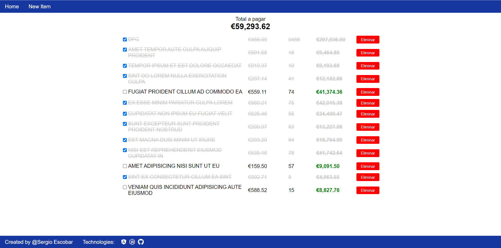
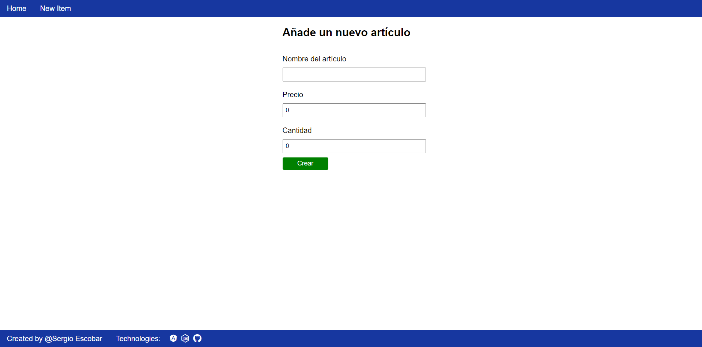

# ShoppingList App | Backend - Frontend
## Backend 👨‍💻 [`backend` folder]

This project was generated with [Node JS](https://nodejs.org/en/) version 16.13.2.

### Development server

Run `npm run start` for a dev server. Navigate to `http://localhost:3000/`. The app will automatically reload if you change any of the source files ([nodemon](https://www.npmjs.com/package/nodemon)).

### Data storage

All the data read, create, edit and delete from the file `data.json`

## Frontend 🧑‍💻 [`shopping-list` folder]

This project was generated with [Angular CLI](https://github.com/angular/angular-cli) version 13.2.0.
### Development server

Run `ng serve` for a dev server. Navigate to `http://localhost:4200/`. The app will automatically reload if you change any of the source files.

### Build

Run `ng build` to build the project. The build artifacts will be stored in the `dist/` directory.

## Structure

You have two routes:
1. **Home**, for showing the shopping list.

2. **Add**, for adding a new item in the shopping list.

## Have fun! 😄